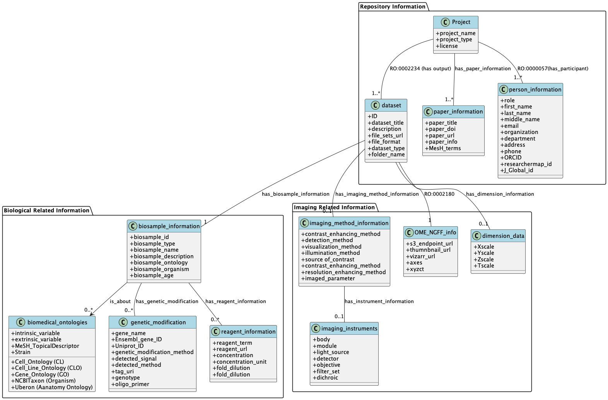
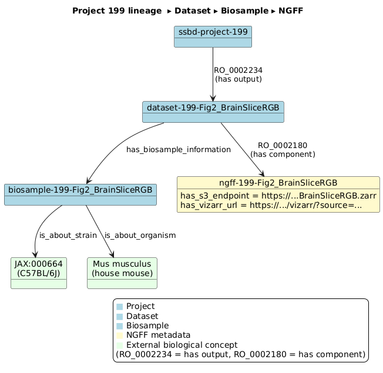

<!-- badges: start -->

[](https://doi.org/10.5281/zenodo.15700645)

<!-- badges: end -->

# SSBD Ontology (v2025‑05)

Lead developer: Yuki Yamagata (RIKEN R-IH and RIKEN BRC)

SSBD Ontology: A Two Tier Approach for Interoperable Bioimaging Metadata
**Repository Layer** (rapid deposition) & **Added‑Value Layer** (curated rich annotations)

　Bioimaging data produced by modern microscopy are expanding at an unprecedented pace, yet their scientific value is often constrained by fragmented metadata. We present the SSBD Ontology, a two-layer semantic model that reconciles rapid publication with ontology-aligned curation. A lightweight repository layer captures only the indispensable descriptors required for DOI assignment, while an added-value layer enriches the same instances with biological context—organism, strain, cell type, anatomy and GO terms—as well as imaging-method and instrument semantics.

The ontology bridges the instance-centric nature of imaging repositories and the class-centric structure of existing OBO ontologies, enabling seamless integration into knowledge graphs. A single SPARQL query retrieves, across modalities, all datasets of C57BL/6J mouse brain recorded by AMATERAS light microscopy and FIB-SEM electron microscopy, returning direct OME-Zarr and Vizarr links in sub-second time.

SSBD Ontology (OWL DL), exemplar instances and conversion scripts are released under CC-BY 4.0 on GitHub and will be mirrored on BioPortal, strengthening the FAIR data ecosystem for bioimaging research.

---

## 1. Ontology 

| Item                              | URL / File                                                    |
| --------------------------------- | ------------------------------------------------------------- |
| Integrated ontology (OWL/RDF/XML) | [`ontology/ssbd_integrated.owl`](ontology/ssbd_integrated.owl) |
| Core ontology (OWL/RDF‑XML)      | [`ontology/ssbd_core.owl`](ontology/ssbd_core.owl)             |
| All individuals (TTL)             | [`instance/ssbd_biosample.ttl`](instance/ssbd_biosample.ttl)   |

### 1.1 Core layer:Seven key entity types



| Layer                | Entity class                        | Typical properties                                                                 | Linked external vocab     |
| -------------------- | ----------------------------------- | ---------------------------------------------------------------------------------- | ------------------------- |
| **Repository** | `SSBD_Project`                    | `has_project_name`, `has_dataset_output (subClassOf RO:0002234)` (→ Dataset) | —                        |
| **Repository** | `SSBD_dataset`                    | `has_biosample_information`, `has_ome_zarr_information` (→ OME-NGFF-ZARR)    | —                        |
| **Added**      | `SSBD_OME_NGFF_ZARR`              | `has_s3_endpoint`, `has_vizarr_url`, sizes                                     | —                        |
| **Added**      | `SSBD_biosample_information`      | `is_about_organism/strain/cell/anatomy/GO*`                                      | NCBITaxon, CL, UBERON, GO |
| **Added**      | `SSBD_imaging_method_information` | `has_detection_method`, `has_imaging_method_recorded_type`                     | FBbi                      |
| **Added**      | `SSBD_imaging_instruments`        | `has_component` (objective, detector …)                                         | —                        |
| **Added**      | `SSBD_dimension_data`             | x/y/z/t scale + unit                                                               | IAO / UO                  |

Seven core entities form a two—tier model: project, Dataset, Biosample, Imaging Method, Instrument, Dimension, and OME-NGFF metadata. We distinguish between the data required for rapid publication in the repository tier and the added-value database tier in SSBD. Within the repository, the essential information comprises a Project, a Dataset, and bibliographic and author (person) information, thereby ensuring the minimum metadata needed for rapid publication. The added-value tier delivers deep, ontology-aligned curation while reusing external OBO vocabularies. SSBD ontology covers entities related to imaging method(e.g., imaging method, imaging device, image dimension, the storage URI of the dataset).

### 1.2 Example instance relationships (Project 199 – AMATERAS brain‑slice)



*Project → Dataset → Biosample → OME‑Zarr* relations
Project 199 (Ichimura): A single Dataset, its Biosample and the associated OME-Zarr metadata are connected via RO relations; external strain and organism terms are linked for immediate cross-repository interoperability.

### 1.3 Quick SPARQL tutorial  🔍

The SSBD graph can be queried live at

https://knowledge.brc.riken.jp/bioresource/sparql

The endpoint supports HTML, JSON, CSV, TSV and RDF results.
If you are new to SPARQL, start with the two ready‑made examples in
[`sparql/tutorial/README.md`](./sparql/tutorial/README.md) – each file contains:

* a short natural‑language question
* the corresponding `.rq` query
* a **clickable link** that opens the query in the endpoint UI

After running the query you can change *Output → Download as* to JSON / CSV, etc.

### 1.4 Sample SPARQL query

```
PREFIX ssbd: <http://ssbd.riken.jp/ontology/>
PREFIX rdfs: <http://www.w3.org/2000/01/rdf-schema#>
PREFIX obo:  <http://purl.obolibrary.org/obo/>

SELECT ?dataset ?bs ?title ?methodIRI ?methodLabel ?zarr ?vizarr
WHERE {
  # --- strain filter (C57BL/6J) ---
  ?bs ssbd:is_about_strain <https://www.jax.org/strain/000664> .

  # --- Dataset ↔ Biosample ---
  ?dataset ssbd:has_biosample_information ?bs ;
           ssbd:has_dataset_title         ?title .
  
    # --- Imaging method  ---
  ?dataset ssbd:has_imaging_method_total_info  ?imNode .
  ?imNode  ssbd:has_imaging_method_recorded_type ?methodIRI .
  OPTIONAL { ?methodIRI rdfs:label ?methodLabel }
  
   # --- NGFF ---
  OPTIONAL {
    ?dataset ssbd:has_ome_zarr_information ?ngff .
    OPTIONAL { ?ngff ssbd:has_s3_endpoint ?zarr }
    OPTIONAL { ?ngff ssbd:has_vizarr_url  ?vizarr }
  }

}
ORDER BY ?methodIRI ?dataset


```

 

A single query retrieves all strain C57BL/6J datasets, together with the imaging-method sub-hierarchical tree, OME-Zarr URLs, and Vizarr viewer.

### 1.5 Related resources and gap analysis of ontology usage

* **foundingGIDE Deliverable D6.1** – Comparative analysis of ontology usage in
  SSBD, IDR, BIA and other imaging repositories, plus a field‑by‑field
  mapping from REMBI to SSBD metadata.
  • Zenodo DOI: [10.5281/zenodo.15553217](https://doi.org/10.5281/zenodo.15553217)
  • Tables 1 (REMBI → SSBD) and 2 (Ontology coverage) are the authoritative
  reference; we therefore link them here rather than duplicating the full
  spreadsheets in this repository.
